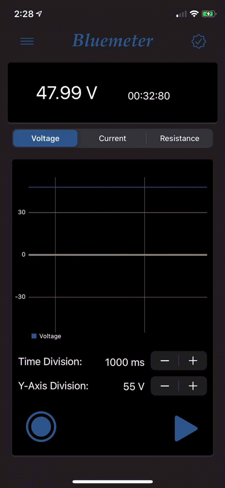

# Bluemeter

***

Bluemeter is a Bluetooth enabled multimeter iOS application that allows a user to send Bluetooth data from a device and graph it in real time. It was developed to be a cost-efficient replacement to an oscilloscope or scopemeter.

## Features
Bluemeter’s key features include:

-	Real time graphing accurate to the 1ms
-	Screen capture of graph auto formatted and saved to photos
-	Pause and continue functionality of receiving and displaying measurements
-	BLE 4/5 compatible
-	Light and dark mode UI auto change based on users iOS display settings

<figure>
  <picture>
    
  </picture>
  <figcaption>Screenrecording of measurements being recieved and displayed.</figcaption>
</figure>

